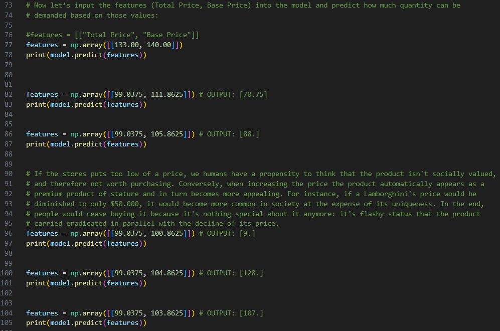
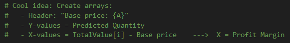
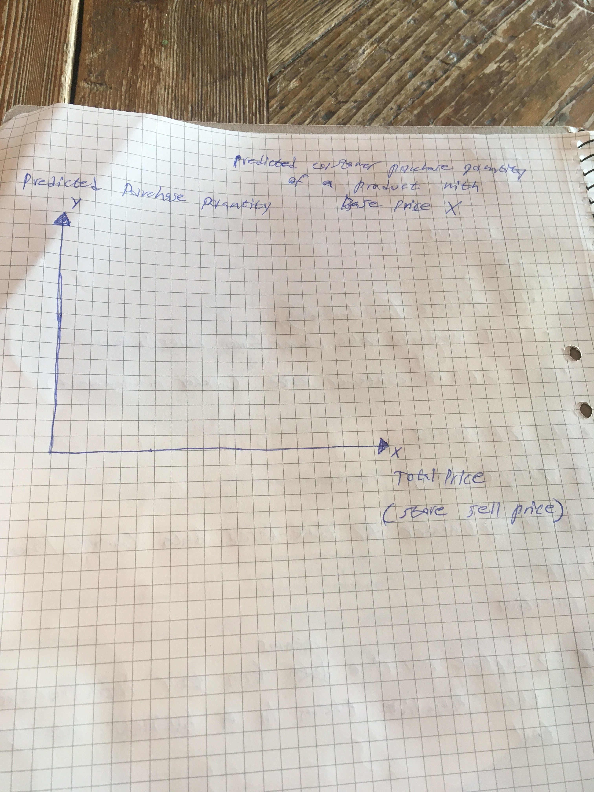
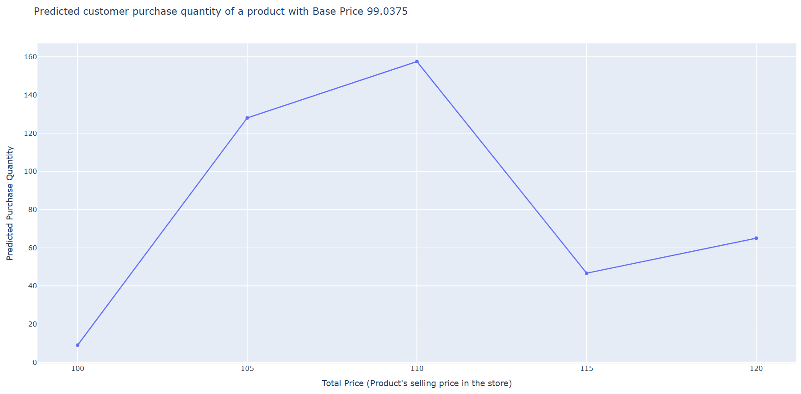

# Product Demand Prediction

In 2024-06-12, I set out to code this project, using [Demand Prediction](https://thecleverprogrammer.com/2021/11/22/product-demand-prediction-with-machine-learning/) as a source to learn how to build machine learning models. This project solves the need of a store ordering an inaccruate about of products in relative to the customers' desires. It's always a challenge to anticipate in what quantity a product will sell for. However, this can be generalized into certain variables that describe the relationship between how much customers would like a product in proportion to its pricing. What happens when a store increases or decreases its pricing? What's the optimal relation between the base-price and total-price that generates the most revenue? These questions are answered by this project.

**Demo:**

## Case - Context

A product company plans to offer discounts on its product during the upcoming holiday season. The company wants to find the price at which its product can be a better deal compared to its competitors. For this task, the company provided a dataset of past changes in sales based on price changes. You need to train a model that can predict the demand for the product in the market with different price segments.

You must have studied that the demand for a product varies with the change in its price. If you take real-world examples, you will see if the product is not a necessity, then its demand decreases with the increase in its price and the demand increases with the decrease in its price.

If the stores puts too low of a price, we humans have a propensity to think that the product isn't socially valued, and therefore not worth purchasing. Conversely, when increasing the price the product automatically appears as a premium product of stature and in turn becomes more appealing. For instance, if a Lamborghini's price would be diminished to only $50.000, it would become more common in society at the expense of its uniqueness. In the end, people would cease buying it because it's nothing special about it anymore: it's flashy status that the product carried eradicated in parallel with the decline of its price.

## Prediction Model

In this project, you can input the "Base Price" and "Total Price" values in which the predictive machine learning model outputs a quantity of the estimated number of units that is expected to be sold. The Base- and Total- Price variables are reflecting the following qualities, that make them relevant to utilize to generate predictions:

    - "Total Price" is what the store that is being examined ("Store_ID") pays external providers to get the specific product in their storage. Hence, this price correlates with the actual market value of the product (the harder something is to produce, the more scarce it becomes and the more people are willing to pay for it)

    - "Base Price" is what the store that is being examined ("Store_ID") sells the product for to their customers

The description of the variables above yields the following mathematical conclusions:

    - Base Price - Total Price = [ Profit margins for the examined store ]

    - Total Price < Base Price  [ The store will ALWAYS sell a product for more than they paid to gain monetary profit ]

## Development Process

Once I had implemented the prediciton model sucessfully, I got an idea. What if X?

### 1. Numerical observation

I was playing around with the values and I noticed a trend. As I decreased the `Base Price` of the same product, the ML-model's predicted sales increased, which inherently is self-explenatory, since lower prices are more affordable. But it triggered a few questions:

- **For how much can we decrease the price of something until its status diminishes?**

- **How does decreasing a product's price destroy the profit margins?**

- **If increasing a product's price also increases the profit margins, what's the optimal relationship between price and generated revenue?**

An analogy embodied in these questions is McDonalds. Sure, the company is known for its cheap prices, but its prices also entail a less luxurious and fancy product. In otherwords, fancy restaurants can create financial leverage of this principle and raise their prices in exchange for less sales but larger profit margins. In the end, enterprises don't care about the quantity of products sold but the revenue generated.

### 2. Idea was born and articulated

After a prolonged reflection about the aforementioned questions, I brought that discussion to the project, and asked myself how I would integrate this as an automated process. I started writing commens in the Python script on the X and Y values, as well as what operations I would need to perform to retrieve those instances.

### 3. Conceptualized idea

Once I had a rough idea of my approach, I made a sketch to clarify my thoughts to myself. Usually our complex minds hold multiple thoughts at the same time such that they clash and interfere, leaving us in a confused state.

### 4. Implemented idea

Lastly, I successfully implemented the functionality and integrated it to the system.

